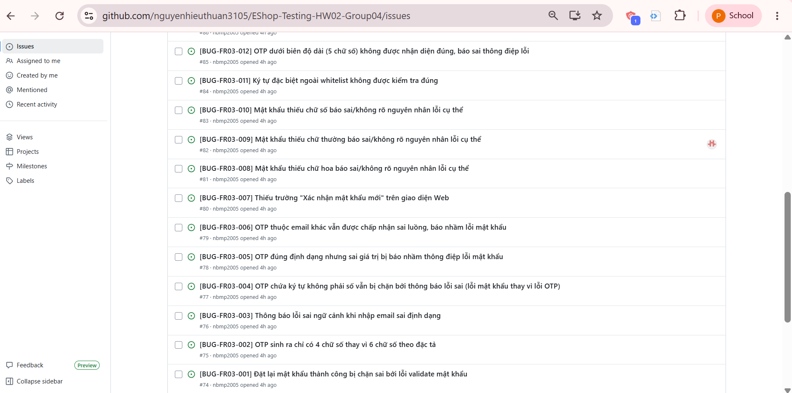
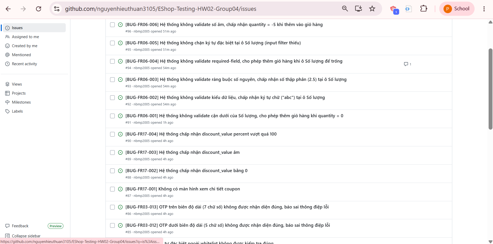

# BUG REPORT

## Tóm tắt

* **Tổng số lỗi:** 19
* **Nguồn:** Main Report.md — Các Test Case đã thực thi
* **Người kiểm thử:** Minh Phương
* **Thời gian:** 08/07/2026

| FR | Số lỗi |
|---|---|
| FR-03: Quên mật khẩu & Đặt lại mật khẩu | 13 |
| FR-11: Xem lịch sử đơn hàng (User) | 0 |
| FR-17: Quản lý Mã Giảm Giá | 5 |
| FR-06: Xem chi tiết sản phẩm (mobile) | 6 |
| **Tổng** | **24** |

---

## FR-03: Quên mật khẩu & Đặt lại mật khẩu (13 lỗi)

| Defect ID | Title | Severity | Priority | Status | Test Case | Pre-condition | Steps to Reproduce | Expected Result | Actual Result | Environment | Found By | Date Found |
|---|---|---|---|---|---|---|---|---|---|---|---|---|
| BUG-FR03-001 | Đặt lại mật khẩu thành công bị chặn sai bởi lỗi validate mật khẩu | Critical | P1 | Open | TC-01, TC-BVA-04 | Người dùng đã có email đăng ký hợp lệ; đang ở màn hình quên mật khẩu, đã qua OTP hợp lệ | 1. Nhập email `test@eshop.com` ở Bước 1 2. Nhấn lấy OTP, ghi lại OTP hiển thị demo 3. Nhập OTP ở Bước 2 4. Nhập mật khẩu mới hợp lệ (VD: `Passw0rd@1`, hoặc 8 ký tự tại biên) 5. Gửi form | Hệ thống chấp nhận yêu cầu reset mật khẩu và hiển thị thành công | Hệ thống vẫn báo lỗi "Mật khẩu quá yếu! Phải dài tối thiểu 8 ký tự, gồm chữ hoa, chữ thường, số và KÝ TỰ ĐẶC BIỆT." dù mật khẩu đã thỏa toàn bộ policy (kể cả tại biên 8 ký tự) | Web Demo | Minh Phương | 08/07/2026 |
| BUG-FR03-002 | OTP sinh ra chỉ có 4 chữ số thay vì 6 chữ số theo đặc tả | High | P2 | Open | TC-02 | Người dùng đang ở Bước 1 | 1. Nhập email `test@eshop.com` 2. Nhấn lấy OTP 3. Quan sát OTP hiển thị demo | Hệ thống sinh OTP 6 chữ số và hiển thị/gửi OTP theo môi trường demo | Hệ thống sinh OTP chỉ 4 chữ số | Web Demo | Minh Phương | 08/07/2026 |
| BUG-FR03-003 | Thông báo lỗi sai ngữ cảnh khi nhập email sai định dạng | Medium | P3 | Open | TC-03 | Người dùng đang ở Bước 1 | 1. Nhập email sai định dạng `test@eshop` 2. Nhấn lấy OTP | Hệ thống từ chối và hiển thị thông báo lỗi email không hợp lệ (sai format) | Hệ thống từ chối nhưng hiển thị thông báo "User not found" (nhầm sang lỗi không tồn tại thay vì sai định dạng) | Web Demo | Minh Phương | 08/07/2026 |
| BUG-FR03-004 | OTP chứa ký tự không phải số vẫn bị chặn bởi thông báo lỗi sai (lỗi mật khẩu thay vì lỗi OTP) | High | P2 | Open | TC-05 | Người dùng đã lấy OTP ở Bước 1 | 1. Nhập email `test@eshop.com` 2. Sang Bước 2 3. Nhập OTP (có ký tự chữ) và nhập mật khẩu mới đúng định dạng quy định| Hệ thống từ chối và báo OTP không hợp lệ | Hệ thống báo lỗi "Mật khẩu quá yếu! Phải dài tối thiểu 8 ký tự, gồm chữ hoa, chữ thường, số và KÝ TỰ ĐẶC BIỆT." (sai thông điệp lỗi) | Web Demo | Minh Phương | 08/07/2026 |
| BUG-FR03-005 | OTP đúng định dạng nhưng sai giá trị bị báo nhầm thông điệp lỗi mật khẩu | High | P2 | Open | TC-06 | Người dùng đã lấy OTP ở Bước 1 | 1. Nhập email `test@eshop.com` 2. Sang Bước 2 3. Nhập OTP sai giá trị `123456` | Hệ thống từ chối và báo OTP không hợp lệ hoặc không khớp | Hệ thống báo lỗi "Mật khẩu quá yếu! Phải dài tối thiểu 8 ký tự, gồm chữ hoa, chữ thường, số và KÝ TỰ ĐẶC BIỆT." (sai thông điệp lỗi) | Web Demo | Minh Phương | 08/07/2026 |
| BUG-FR03-006 | OTP thuộc email khác vẫn được chấp nhận sai luồng, báo nhầm lỗi mật khẩu | Critical | P1 | Open | TC-07 | Có ít nhất 2 email đã đăng ký | 1. Lấy OTP cho email A `test@eshop.com` 2. Sang Bước 2 của email B `admin@eshop.com` 3. Nhập OTP của email A | Hệ thống từ chối vì OTP không khớp với email đang yêu cầu | Hệ thống báo lỗi "Mật khẩu quá yếu! Phải dài tối thiểu 8 ký tự, gồm chữ hoa, chữ thường, số và KÝ TỰ ĐẶC BIỆT." (không kiểm tra ràng buộc OTP-email) | Web Demo | Minh Phương | 08/07/2026 |
| BUG-FR03-007 | Thiếu trường "Xác nhận mật khẩu mới" trên giao diện Web | High | P2 | Open | TC-10 | Người dùng đã qua OTP hợp lệ | 1. Nhập OTP hiển thị demo 2. Nhập mật khẩu mới `Passw0rd@1` 3. Tìm trường xác nhận mật khẩu để nhập `Passw0rd@2` 4. Gửi form | Hệ thống từ chối và báo hai mật khẩu không khớp | Trên giao diện Web hiện tại không có trường "Xác nhận mật khẩu mới"; không thể thực hiện tiếp bước kiểm tra | Web Demo | Minh Phương | 08/07/2026 |
| BUG-FR03-008 | Mật khẩu thiếu chữ hoa báo sai/không rõ nguyên nhân lỗi cụ thể | Medium | P3 | Open | TC-11 | Người dùng đã qua OTP hợp lệ | 1. Nhập OTP hiển thị demo 2. Nhập mật khẩu mới `passw0rd@1` (thiếu chữ hoa) 3. Nhập xác nhận `passw0rd@1` 4. Gửi form | Hệ thống từ chối và báo mật khẩu không đạt policy (thiếu chữ hoa) | Hệ thống báo lỗi chung chung "Mật khẩu quá yếu! Phải dài tối thiểu 8 ký tự, gồm chữ hoa, chữ thường, số và KÝ TỰ ĐẶC BIỆT." không chỉ rõ thiếu chữ hoa | Web Demo | Minh Phương | 08/07/2026 |   
| BUG-FR03-009 | Mật khẩu thiếu chữ thường báo sai/không rõ nguyên nhân lỗi cụ thể | Medium | P3 | Open | TC-12 | Người dùng đã qua OTP hợp lệ | 1. Nhập OTP hiển thị demo 2. Nhập mật khẩu mới `PASSW0RD@1` (thiếu chữ thường) 3. Nhập xác nhận `PASSW0RD@1` 4. Gửi form | Hệ thống từ chối và báo mật khẩu không đạt policy (thiếu chữ thường) | Hệ thống báo lỗi chung chung "Mật khẩu quá yếu! Phải dài tối thiểu 8 ký tự, gồm chữ hoa, chữ thường, số và KÝ TỰ ĐẶC BIỆT." không chỉ rõ thiếu chữ thường | Web Demo | Minh Phương | 08/07/2026 |
| BUG-FR03-010 | Mật khẩu thiếu chữ số báo sai/không rõ nguyên nhân lỗi cụ thể | Medium | P3 | Open | TC-13 | Người dùng đã qua OTP hợp lệ | 1. Nhập OTP hiển thị demo 2. Nhập mật khẩu mới `Password@` (thiếu chữ số) 3. Nhập xác nhận `Password@` 4. Gửi form | Hệ thống từ chối và báo mật khẩu không đạt policy (thiếu chữ số) | Hệ thống báo lỗi chung chung "Mật khẩu quá yếu! Phải dài tối thiểu 8 ký tự, gồm chữ hoa, chữ thường, số và KÝ TỰ ĐẶC BIỆT." không chỉ rõ thiếu chữ số | Web Demo | Minh Phương | 08/07/2026 |
| BUG-FR03-011 | Ký tự đặc biệt ngoài whitelist không được kiểm tra đúng | Medium | P3 | Open | TC-14 | Người dùng đã qua OTP hợp lệ | 1. Nhập OTP hiển thị demo 2. Nhập mật khẩu mới `Passw0rd#1` (`#` không nằm trong whitelist `@ $ ! % * ? &`) 3. Nhập xác nhận `Passw0rd#1` 4. Gửi form | Hệ thống từ chối vì `#` không thuộc danh sách ký tự đặc biệt hợp lệ | Hệ thống báo lỗi chung chung "Mật khẩu quá yếu! Phải dài tối thiểu 8 ký tự, gồm chữ hoa, chữ thường, số và KÝ TỰ ĐẶC BIỆT." không phân biệt được ký tự đặc biệt hợp lệ/không hợp lệ | Web Demo | Minh Phương | 08/07/2026 |
| BUG-FR03-012 | OTP dưới biên độ dài (5 chữ số) không được nhận diện đúng, báo sai thông điệp lỗi | Medium | P3 | Open | TC-BVA-01 | Người dùng đã lấy OTP cho email hợp lệ | 1. Nhập email `test@eshop.com` ở Bước 1 2. Sang Bước 2 3. Nhập OTP `12345` (5 chữ số) 4. Nhập mật khẩu mới `Passw0rd@1` và xác nhận 5. Gửi form | Hệ thống từ chối vì OTP không đạt biên 6 chữ số | Hệ thống báo lỗi "Mật khẩu quá yếu! Phải dài tối thiểu 8 ký tự, gồm chữ hoa, chữ thường, số và KÝ TỰ ĐẶC BIỆT." (sai thông điệp lỗi) | Web Demo | Minh Phương | 08/07/2026 |
| BUG-FR03-013 | OTP trên biên độ dài (7 chữ số) không được nhận diện đúng, báo sai thông điệp lỗi | Medium | P3 | Open | TC-BVA-02 | Người dùng đã lấy OTP cho email hợp lệ | 1. Nhập email `test@eshop.com` ở Bước 1 2. Sang Bước 2 3. Nhập OTP `1234567` (7 chữ số) 4. Nhập mật khẩu mới `Passw0rd@1` và xác nhận 5. Gửi form | Hệ thống từ chối vì OTP vượt biên độ dài cho phép | Hệ thống báo lỗi "Mật khẩu quá yếu! Phải dài tối thiểu 8 ký tự, gồm chữ hoa, chữ thường, số và KÝ TỰ ĐẶC BIỆT." (sai thông điệp lỗi) | Web Demo | Minh Phương | 08/07/2026 |

---

## FR-11: Xem lịch sử đơn hàng (User) (0 lỗi)

Không phát hiện lỗi mới trong quá trình kiểm thử FR-11. Tất cả các Test Case Domain và BVA đều **Passed**, ngoại trừ 2 test case bị **Blocked** do hệ thống hiện chưa có chức năng tìm kiếm theo mã đơn hàng (TC-08 / TC-BVA-04), tuy nhiên các test case này chưa được gán Defect ID nên không đưa vào bảng lỗi.

---

## FR-17: Quản lý Mã Giảm Giá (6 lỗi)

| Defect ID | Title | Severity | Priority | Status | Test Case | Pre-condition | Steps to Reproduce | Expected Result | Actual Result | Environment | Found By | Date Found |
|---|---|---|---|---|---|---|---|---|---|---|---|---|
| BUG-FR17-001 | Không có màn hình xem chi tiết coupon | High | P2 | Open | TC-04 | Admin `admin@eshop.com` đã đăng nhập và có coupon `SUMMER2026` trong hệ thống | 1. Mở danh sách coupon 2. Chọn coupon `SUMMER2026` 3. Mở màn hình chi tiết | Chi tiết coupon hiển thị đúng code, type, discount_value, expired_at, min_order_amount và max_uses_per_user | Không có màn hình chi tiết coupon | Web Demo | Minh Phương | 08/07/2026 |
| BUG-FR17-002 | Hệ thống chấp nhận discount_value bằng 0 | Critical | P1 | Open | TC-08, TC-BVA-01 | Admin `admin@eshop.com` đã đăng nhập | 1. Mở form thêm coupon 2. Nhập `discount_value = 0` (type: fixed hoặc percent) 3. Lưu coupon | Hệ thống từ chối tạo coupon và báo giá trị giảm phải dương | Hệ thống chấp nhận coupon với discount_value = 0 và hiển thị trong danh sách | Web Demo | Minh Phương | 08/07/2026 |
| BUG-FR17-003 | Hệ thống chấp nhận discount_value âm | Critical | P1 | Open | TC-09 | Admin `admin@eshop.com` đã đăng nhập | 1. Mở form thêm coupon 2. Nhập `discount_value = -5` 3. Lưu coupon | Hệ thống từ chối tạo coupon và báo giá trị giảm không hợp lệ | Hệ thống chấp nhận coupon với discount_value = -5 và hiển thị trong danh sách | Web Demo | Minh Phương | 08/07/2026 |
| BUG-FR17-004 | Hệ thống chấp nhận discount_value percent vượt quá 100 | Critical | P1 | Open | TC-10 | Admin `admin@eshop.com` đã đăng nhập | 1. Mở form thêm coupon 2. Nhập `type: percent`, `discount_value = 101` 3. Lưu coupon | Hệ thống từ chối tạo coupon và báo phần trăm giảm không hợp lệ | Hệ thống chấp nhận coupon với discount_value = 101% và hiển thị trong danh sách | Web Demo | Minh Phương | 08/07/2026 |
| BUG-FR17-005 | min_order_amount âm không được validate rõ ràng ở phía UI (thông báo lỗi chưa nhất quán) | Medium | P3 | Open | TC-13 | Admin `admin@eshop.com` đã đăng nhập | 1. Mở form thêm coupon 2. Nhập `min_order_amount = -1` 3. Lưu coupon | Hệ thống từ chối tạo coupon và báo `min_order_amount` phải >= 0 | Hệ thống chấp nhận tạo coupon với min_order_amount âm| Web Demo | Minh Phương | 08/07/2026 |
---
## FR-06: Xem chi tiết sản phẩm (User) - Mobile (6 lỗi)
| Defect ID | Title | Severity | Priority | Status | Test Case | Pre-condition | Steps to Reproduce | Expected Result | Actual Result | Environment | Found By | Date Found |
|---|---|---|---|---|---|---|---|---|---|---|---|---|
| BUG-FR06-001 | Hệ thống không validate cận dưới của Số lượng, cho phép thêm giỏ hàng khi quantity = 0 | High | High | Open | TC-02 | Sản phẩm đang "Còn hàng" | 1. Mở màn hình chi tiết sản phẩm 2. Nhập 0 vào ô Số lượng 3. Bấm "Thêm vào giỏ hàng" | Hệ thống từ chối, hiển thị lỗi "Số lượng phải lớn hơn hoặc bằng 1"; không thêm vào giỏ hàng | Hệ thống ghi nhận "Đã thêm giỏ hàng thành công", giỏ hàng +1 | Mobile App | Minh Phương | 9/7/2026 |
| BUG-FR06-002 | Hệ thống không validate kiểu dữ liệu, chấp nhận ký tự chữ ("abc") tại ô Số lượng | High | High | Open | TC-03 | Sản phẩm đang "Còn hàng" | 1. Mở màn hình chi tiết sản phẩm 2. Nhập "abc" vào ô Số lượng 3. Bấm "Thêm vào giỏ hàng" | Hệ thống từ chối nhập/hiển thị lỗi "Vui lòng nhập số nguyên hợp lệ"; không thêm vào giỏ hàng | Hệ thống ghi nhận "Đã thêm giỏ hàng thành công", giỏ hàng +1 | Mobile App | Minh Phương | 9/7/2026 |
| BUG-FR06-003 | Hệ thống không validate ràng buộc số nguyên, chấp nhận số thập phân (2.5) tại ô Số lượng | Medium | Medium | Open | TC-04 | Sản phẩm đang "Còn hàng" | 1. Mở màn hình chi tiết sản phẩm 2. Nhập 2.5 vào ô Số lượng 3. Bấm "Thêm vào giỏ hàng" | Hệ thống từ chối, hiển thị lỗi "Số lượng phải là số nguyên"; không thêm vào giỏ hàng | Hệ thống ghi nhận "Đã thêm giỏ hàng thành công", giỏ hàng +1 | Mobile App | Minh Phương | 9/7/2026 |
| BUG-FR06-004 | Hệ thống không validate required-field, cho phép thêm giỏ hàng khi ô Số lượng để trống | High | High | Open | TC-05 | Sản phẩm đang "Còn hàng" | 1. Mở màn hình chi tiết sản phẩm 2. Để trống ô Số lượng 3. Bấm "Thêm vào giỏ hàng" | Hệ thống hiển thị lỗi "Vui lòng nhập số lượng"; không thêm vào giỏ hàng | Hệ thống ghi nhận "Đã thêm giỏ hàng thành công", giỏ hàng +1 | Mobile App | Minh Phương | 9/7/2026 |
| BUG-FR06-005 | Hệ thống không chặn ký tự đặc biệt tại ô Số lượng (input filter thiếu) | Medium | Medium | Open | TC-06 | Sản phẩm đang "Còn hàng" | 1. Mở màn hình chi tiết sản phẩm 2. Nhập "!@#$%" vào ô Số lượng 3. Bấm "Thêm vào giỏ hàng" | Hệ thống từ chối nhập/hiển thị lỗi "Số lượng không hợp lệ"; không thêm vào giỏ hàng | Hệ thống ghi nhận "Đã thêm giỏ hàng thành công", giỏ hàng +1 | Mobile App | Minh Phương | 9/7/2026 |
| BUG-FR06-006 | Hệ thống không validate số âm, chấp nhận quantity = -5 khi thêm vào giỏ hàng | Critical | Critical | Open | TC-07 | Sản phẩm đang "Còn hàng" | 1. Mở màn hình chi tiết sản phẩm 2. Nhập -5 vào ô Số lượng 3. Bấm "Thêm vào giỏ hàng" | Hệ thống từ chối, hiển thị lỗi "Số lượng phải là số nguyên dương"; không thêm vào giỏ hàng | Hệ thống ghi nhận "Đã thêm giỏ hàng thành công", giỏ hàng +1 | Mobile App | Minh Phương | 9/7/2026 |

# Group evidence

[Link nhóm](https://github.com/nguyenhieuthuan3105/EShop-Testing-HW02-Group04)